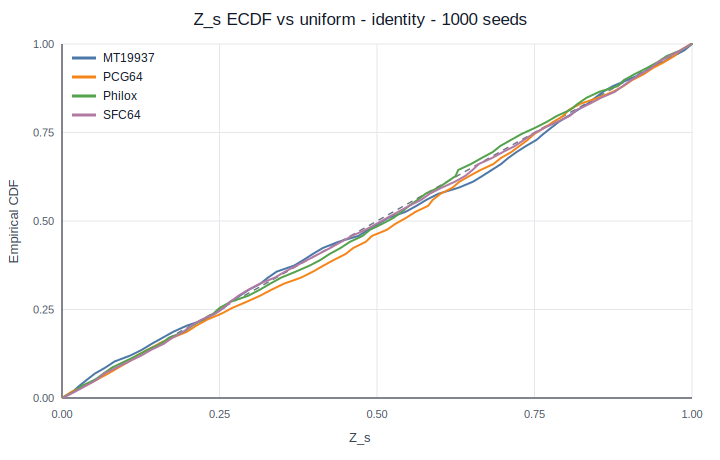
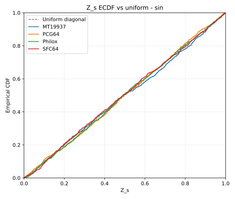
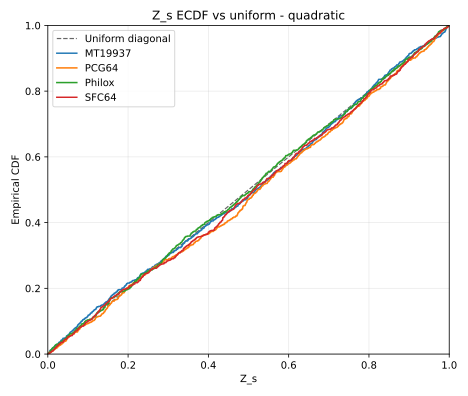
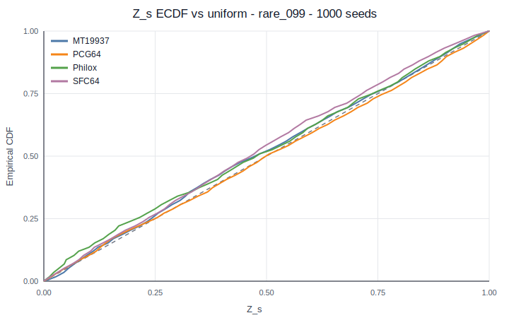
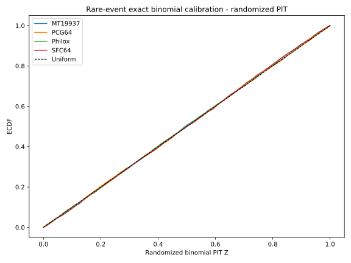

# Generated Figures

This directory contains versioned `Z_s` figures for the calibrated PRNG variance diagnostic.

The ECDF figures are the preferred visual diagnostic because they compare the empirical distribution of `Z_s` directly to the uniform diagonal `F(z)=z`.

| Integrand | ECDF figure |
|---|---|
| `identity` |  |
| `sin` |  |
| `quadratic` |  |
| `rare_099` |  |

The exact/randomized binomial rare-event PIT figure is:

| Diagnostic | ECDF figure |
|---|---|
| `rare_099` binomial PIT |  |

Histogram figures are also supported by the pipeline:

```bash
python scripts/plot_z_histograms.py \
  --input results/z_scores_table.csv \
  --outdir figures
```

ECDF figures are generated with:

```bash
python scripts/plot_z_ecdf.py \
  --input results/z_scores_table.csv \
  --outdir figures
```

The current reference run uses `N=50000`, `R=8`, and `1000` seeds per generator. The full seed-level CSV files are derived artifacts and can be regenerated from the scripts.
