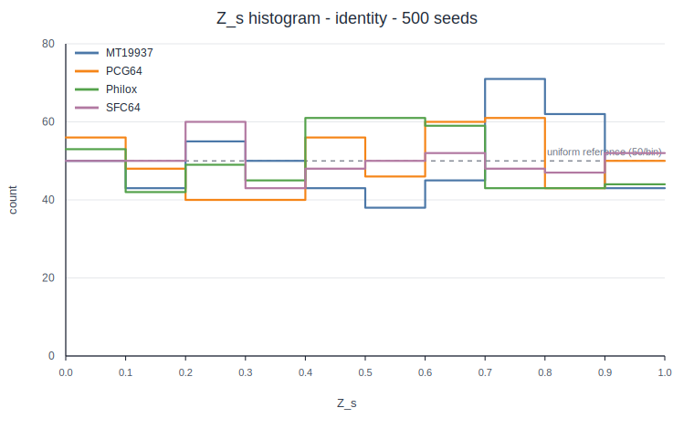
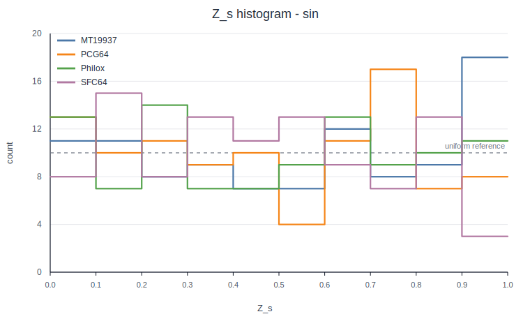
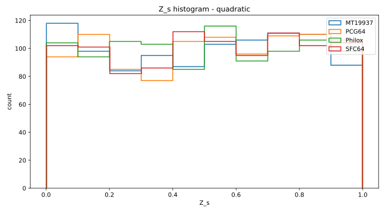
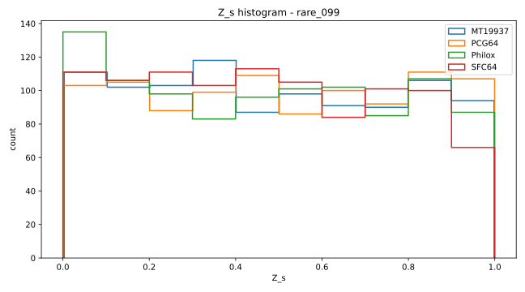

# Generated Figures

This directory contains versioned `Z_s` histogram figures for the calibrated PRNG variance diagnostic.

The SVG figures are committed so they render directly in GitHub:

| Integrand | Figure |
|---|---|
| `identity` |  |
| `sin` |  |
| `quadratic` |  |
| `rare_099` |  |

Each figure compares the empirical distribution of `Z_s` across the public CPU reference PRNGs and shows the uniform reference level.

PNG equivalents can be regenerated locally with:

```bash
python scripts/plot_z_histograms.py \
  --input results/z_scores_table.csv \
  --outdir figures
```

Expected PNG outputs:

```text
figures/hist_Zs_identity.png
figures/hist_Zs_sin.png
figures/hist_Zs_quadratic.png
figures/hist_Zs_rare_099.png
```

The committed SVGs are lightweight visual artifacts derived from the reproducible `z_scores_table.csv` run. The publication run should still record the final `N`, `R`, seed count, and generator list in the main README or result summary.
